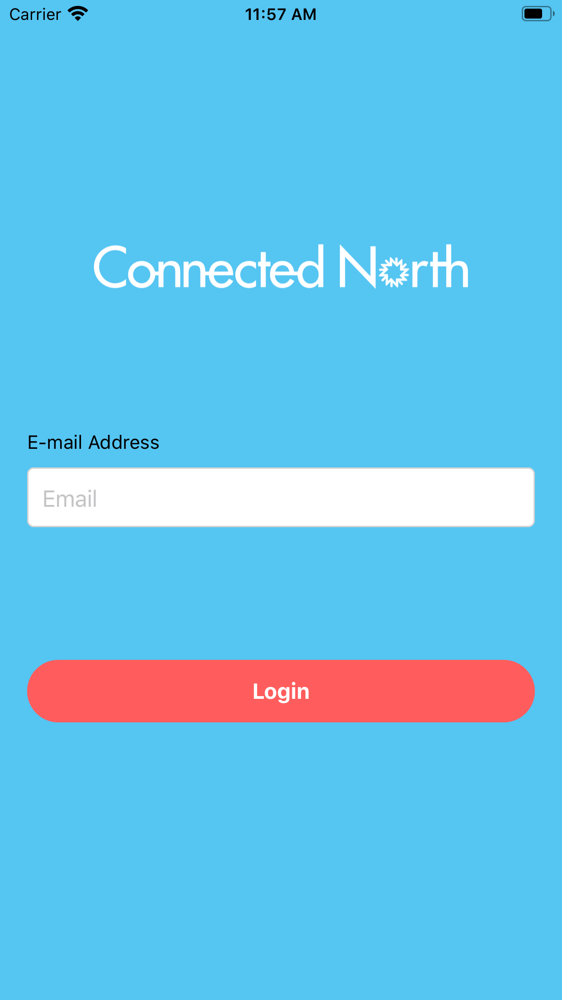
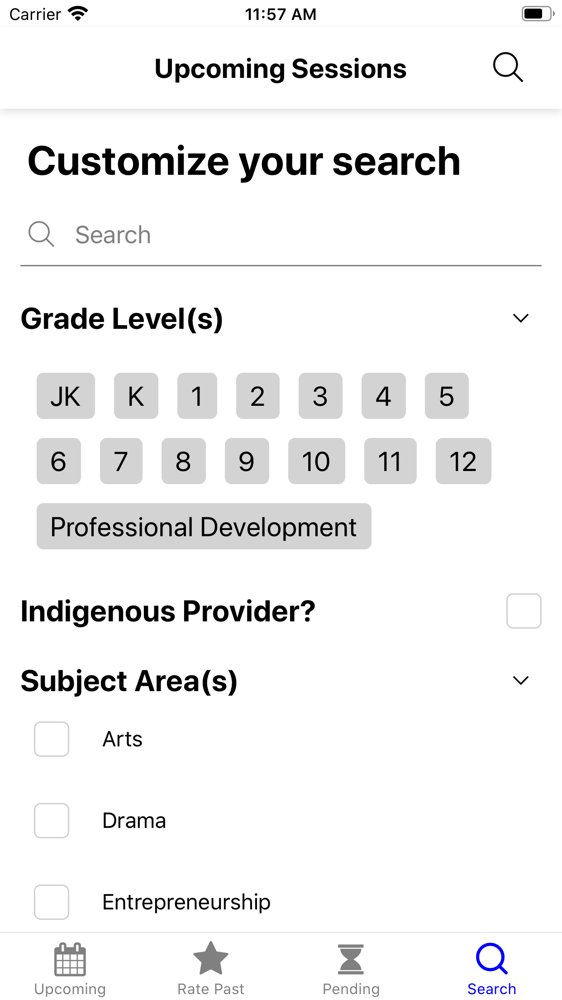
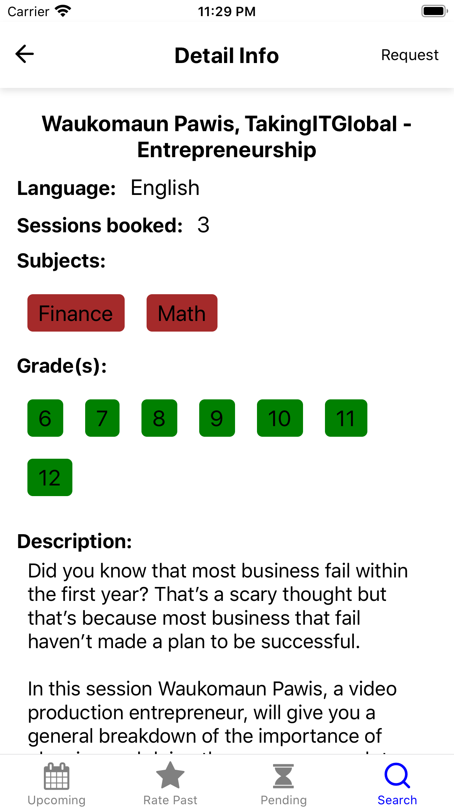
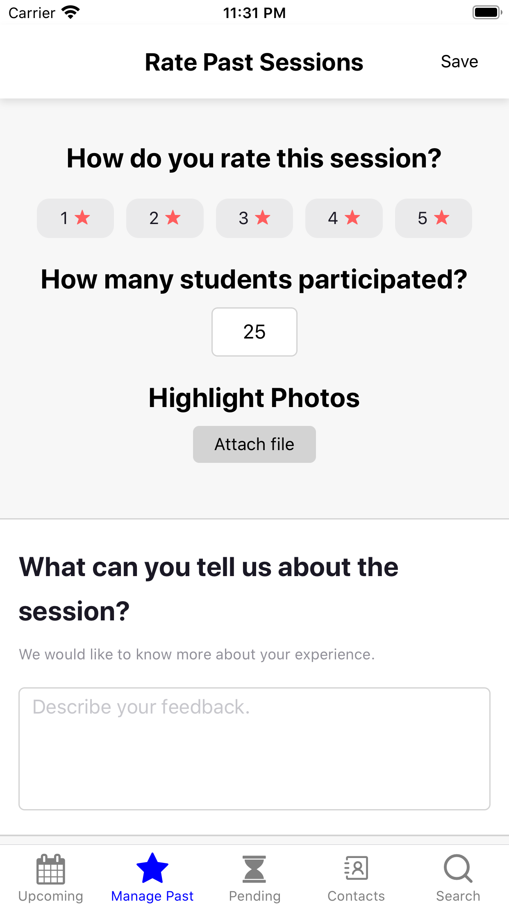

# Connected North

Connected North fosters student engagement and enhanced education outcomes in remote Indigenous communities. This leading edge program delivers immersive and interactive education services, through Cisco's high definition, two-way TelePresence video technology. The program is made possible through a strong ecosystem of supporters with program delivery managed by TakingITGlobal. The goal is to provide students and teachers with access to content that is engaging and innovative, with the hope of increasing feelings of empowerment in school and in life.

The Connected North app helps participating educators, content providers, and team members manage their involvement with the program!

   