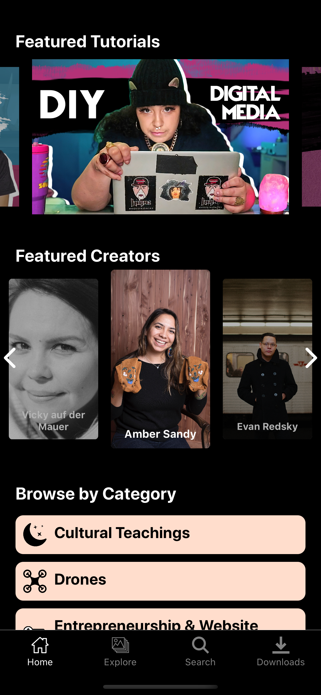
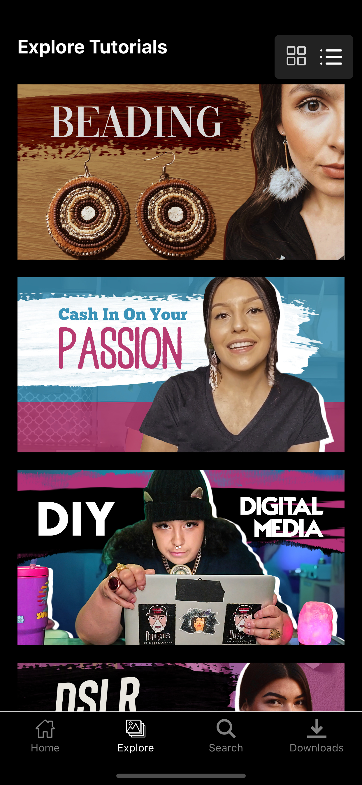
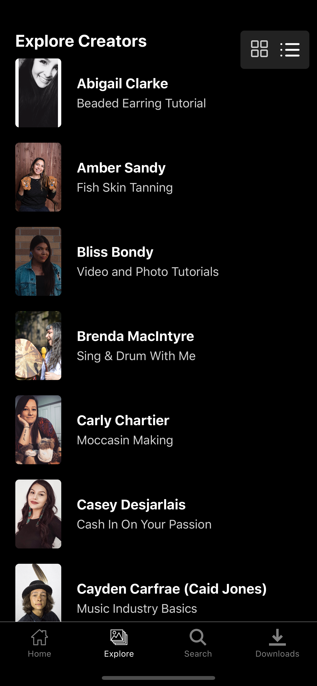
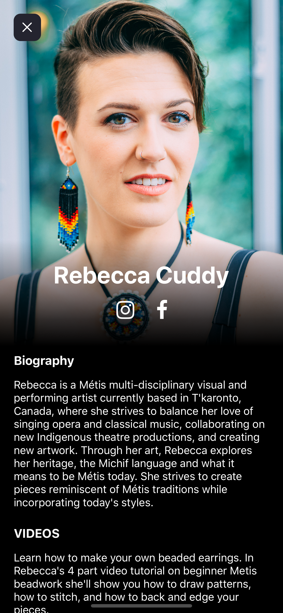
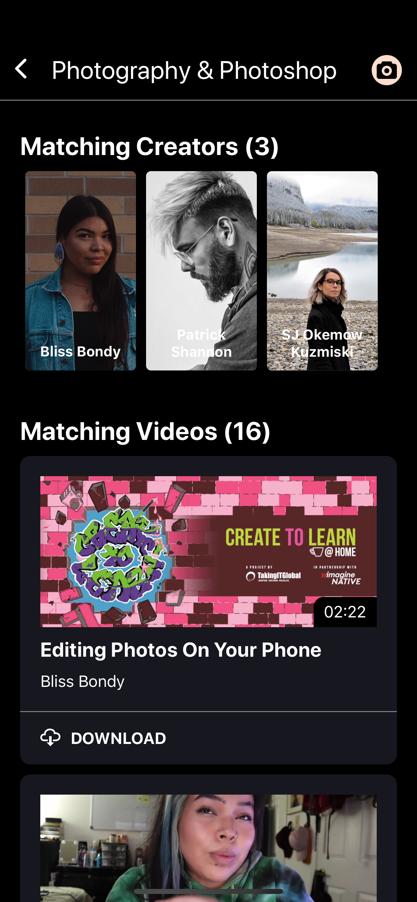
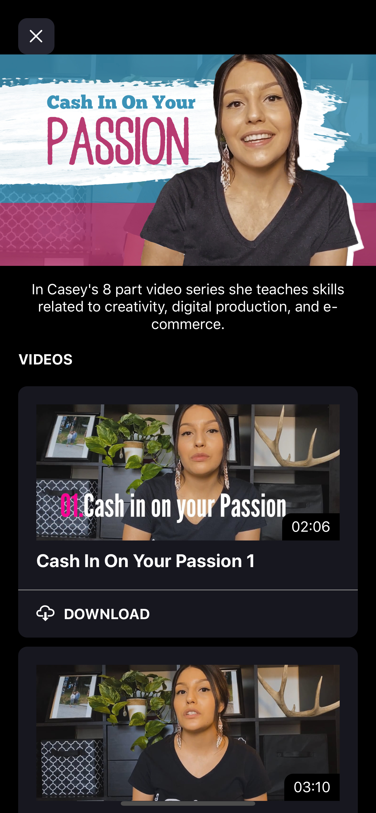

# Create to Learn

The Create to Learn app offers a collection of more than 150 video tutorials on digital skills and traditional knowledge using digital tools. The tutorials are all created by First Nations, Métis and Inuit creators to share their skills with students and youth.

Browse by category to build the skills you're most interested in, explore the topic offered by each creator, and download and store videos to learn offline!

Create to Learn is a program of TakingITGlobal in partnership with ImagineNATIVE. New creators and videos are welcome, send us a message on Instagram or an e-mail via our web site if you'd like to participate and share your knowledge!

[Android](https://play.google.com/store/apps/details?id=com.createtolearn_ios&hl=en) | [iOS](https://apps.apple.com/us/app/create-to-learn/id1505299634)

 |  |  |  |  | 